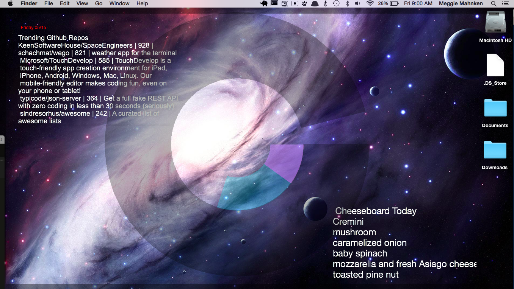

# Geektool Scripts  

## What is geektool?
Geektool is a desktop application that allows the output of any script (python, bash, etc.) to be displayed on your desktop screen. The output can be styled using Geektool as well. 

With the help of geektool my desktop looks like this:

You can download geektool here.

## These scripts

You can accomplish a lot on geektool using built-in Bash functions for date, time, CPU, etc. However, I wanted to display the trending Github repos each day, as well as the daily pizza ingredients at one of my favorite pizza spots. So, I used python and beautiful soup to scrape the relevant websites for that data.

## What about those arcs?

In order to programmatically create those big transparent arcs on my desktop, I used the ARCfont. The a in ARCfont will display as a 0% arc, the b as 2%, the c as 4%, and on up to capital A - Y to make 100%.

In order to convert the numbers for disc space and CPU into letters, I used python. (See `user_cpu.py`, `sys_cpu.py`, and `disc_space.py`).

Happy geeking.
